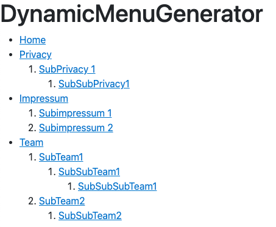

# Dynamic Menu Generator

The reason for the project was to deal with Reflection and custom attributes in C#.

### The problem:

If, for example, a controller or a Razor page is created, the navbar must be created/updated manually in the layout.

It is possible to automate such a step with Reflection and custom attributes.

### How should it work

It should be possible to mark classes as navbar items using annotation and these classes are then rendered into a navbar.

## Implementation

### 1. Attribute

First of all, we need to create an attribute that can be called.
For this we create a class that inherits from the Attribute class.

In this class we will create properties that will be specified in the attribute declaration.

```csharp 
public class MenuItemAttribute : Attribute
{
        public string Route { get; set; }
        public string MenuItemName { get; set; }
        public Type OwnType { get; set; }
        public Type? Parent { get; set; }
    
    public MenuItemAttribute(string route, string menuItemName,Type ownType, Type? parent = null)
    {
        Route = route;
        MenuItemName = menuItemName;
        OwnType = ownType;
        Parent = parent;
    }
}
```
The route prop should store the url to the page f.e "/MenuPages/SomePage".   
Menuitem name is the name which will be displayed in the nav.  
OwnType as the name suggets, the type where the attribute is placed.

There are several techniques to implement this use case. 
The simplest solution is to reference the parent menu item by its name or route value. But strings are prone to typos. 
So we want to implement a type-safe technique using the typeof operator. 
So we declare the type of the parent menu item as a type to store the type of the razor page.

### 2. Service

Lets head to the service class where the magic happens.


```csharp 

    //(2)
    public record MenuItem(string Route, 
        string MenuItemName, 
        Type OwnType, 
        List<MenuItem>? SubMenus = null,
        Type? Parent = null);
    
    public class MenuItemService
    {
        public List<MenuItem> MenuItems { get; } //(3)
        private readonly Type[] _types; //(1)
    
        public MenuItemService()
        {
            _types = Assembly.GetEntryAssembly()?.GetTypes() ?? Array.Empty<Type>(); //(1)
            MenuItems = GetMenuItems(null); // (4)
        }
        
        //(4)
        private List<MenuItem> GetMenuItems(Type? parent)
        {
            var menuItems = _types.SelectMany(t => t.GetCustomAttributes(typeof(MenuItemAttribute), true))
                .OfType<MenuItemAttribute>()
                .Where(m => m.Parent == parent)
                .Select(m => new MenuItem(m.Route, m.MenuItemName, m.OwnType, GetMenuItems(m.OwnType), m.Parent))
                .ToList();
            return menuItems;
        }
    }
```

(1) First of all I declared a _type variable where the types of the assembly are stored, this is instantiated in the constructor,
since the program cannot change in the runtime so we save calling it over and over again.

(2) Furthermore I have created a record where then the data of the menuitems are stored.

(3) A list of type MenuItem where our final result will be stored. 

(4) Assignment of the list and starts the search for the attributes.
The GetMenuItems method recursively searches the assembly types and builds a list of menu items and some menu items again 
have a list of menu items and so on.

I am using the [getCustomAttribute method](https://learn.microsoft.com/en-us/dotnet/api/system.attribute.getcustomattribute?view=net-7.0) to access my defined attribute and cast it to an MenuItemAttribute.
After that i can use the properties and perform a query, this query is used to establish the hierarchical relationship between menu items. 
It ensures that the GetMenuItems method only selects and creates menu items that are direct children of the specified parent type or top-level menu items if parent is null. 
Submenuitems are determined by the Parent property of the MenuItemAttribute.


### Register singleton service

We need to register our service in program.cs as singleton: 

```csharp  
builder.Services.AddSingleton<MenuItemService>(); 
```

Now our service is instantiated once and every time the service is needed, it is taken from this one instance and is not recreated.

### Declaration

For testing, I have only defined classes without any bodies.

``` csharp
    [MenuItem(route: "/MenuPages/Impressum", menuItemName: "Impressum", ownType: typeof(Impressum), parent: null)]
    public class Impressum : PageModel { }
    
    [MenuItem(route:"/MenuPages/SubImpressum1", menuItemName: "Subimpressum 1", ownType: typeof(SubImpressum1),parent: typeof(Impressum))]
    public class SubImpressum1 : PageModel { }
    
    [MenuItem(route:"/MenuPages/SubImpressum2", menuItemName: "Subimpressum 2", ownType: typeof(SubImpressum2), parent: typeof(Impressum))]
    public class SubImpressum2 : PageModel { }

    [MenuItem(route:"/MenuPages/SubPrivacy1", menuItemName: "SubPrivacy 1", ownType: typeof(SubPrivacy1),parent: typeof(PrivacyModel))]
    public class SubPrivacy1 : PageModel { }
    
    [MenuItem(route:"/MenuPages/SubSubPrivacy1", menuItemName: "SubSubPrivacy1", ownType: typeof(SubSubPrivacy1),parent: typeof(SubPrivacy1))]
    public class SubSubPrivacy1 : PageModel { }

    [MenuItem(route:"/MenuPages/Team" ,menuItemName: "Team", ownType: typeof(Team), parent: null)]
    public class Team : PageModel { }
    
    [MenuItem(route:"/MenuPages/SubTeam1", menuItemName: "SubTeam1", ownType: typeof(SubTeam1), parent: typeof(Team))]
    public class SubTeam1 : PageModel { }
```


### 3. Rendering

Now we have list full of menuitems which we have to render into a nav.

For this I added two methods in the _Layout.cshtml: 
```csharp 
@functions
{
    async Task PrintMenu(List<MenuItem> menuItems) {
        <ul>
            @foreach (var menuItem in menuItems){
                await RenderMenuItem(menuItem);
            }
        </ul>
    }

    async Task RenderMenuItem(MenuItem menuItem)
    {
        <li><a href="@menuItem.Route">@menuItem.MenuItemName</a></li>
        @if (menuItem.SubMenus != null && menuItem.SubMenus.Count > 0)
        {
            <ol>
                @foreach (var subMenuItem in menuItem.SubMenus)
                {
                    await RenderMenuItem(subMenuItem);
                }
            </ol>
        }
    }
}
```
Printmenu takes a list and looped through each elements and calls RenderMenuItem where the items is check for subItems if not the Item is going to printed, if subitems exist it recursively invokes the RenderMenuItem method to render the submenu item.

Printmenu takes a list and loops through each item and calls RenderMenuItem, checking for sub-items if the item is a top level menuitem it is printed. 
If sub-items are present, the RenderMenuItem method is called recursively to render the sub-menu item.

And then call the PrintMenu method in the header:

```csharp 
<header>
    <h1>DynamicMenuGenerator</h1>
    @{ await PrintMenu(MenuItemService.MenuItems); }
</header>
```
## Result


